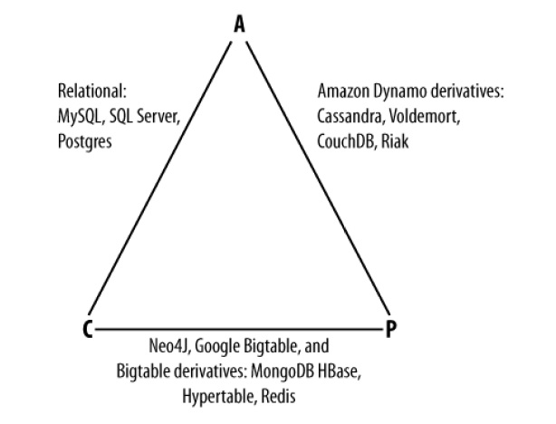
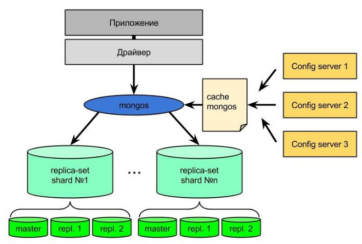
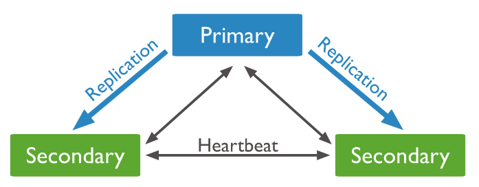
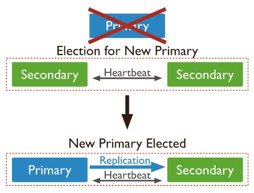
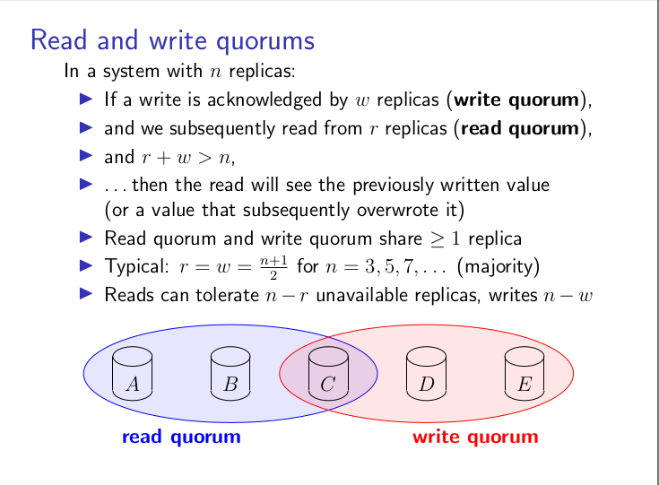

# CAP теорема

## Терминология

Что стоит за **CAP**

В **CAP** говорится, что в распределенной системе возможно выбрать только 2 из 3-х свойств:

C (**consistency**) — согласованность. Каждое чтение даст вам самую последнюю запись.

A (**availability**) — доступность. Каждый узел (не упавший) всегда успешно выполняет запросы (на чтение и запись).

P (**partition tolerance**) — устойчивость к распределению. Даже если между узлами нет связи, они продолжают работать независимо друг от друга.

## В основном это всё треугольник

Описание **CAP** сводятся к простому треугольнику.

# Применяем на практике

Для применения CAP теоремы на практике можно рассмотреть  3 наиболее  подходящие и достаточно популярные системы баз данных: MongoDB, Cassandra, MSSQL.

## MongoDB - документо-ориентированная база данных.

Следующие пункты относятся к абстрактной распределенной БД MongoDB.

* MongoDB обеспечивает strong consistency, потому что это система с одним Master узлом, и все записи идут по умолчанию в него.

* Автоматическая смена мастера, в случае отделения его от остальных узлов.

* В случае разделения сети, система прекратит принимать записи до тех пор, пока не убедится, что может безопасно завершить их.

Схема кластера MongoDB.

Схема replica-set

Внутри каждой replica-set осуществляется выбор primary ноды, который отвечает за все операции записи.
Операции чтения/записи используют концепцию read/write concern.

Возможные значения write concern
* majority - операция записи считается успешно зафиксированной, если запись реплицировалась на большинство узлов (например на 1 secondary реплику если в replica-set 3 узла, на 2 secondary реплики если в replica-set 5 узлов).
* number - операция записи считается успешно зафиксированной, если запись реплицировалась на <number> secondary реплик.
* custom - например используется в случае multi datacenter кластеров.

Я предполагаю, что MongoDB можно считать **CP** системой если используется write concern с фиксацией записи в primary ноде и "linearizable" read concern.
Ограничения
* Операция чтения может затрагивать только один документ.
* Операция чтения в силу "linearizable" read concern проходит только через primary ноду.

*MongoDB* не может считаться **AP** системой в силу того, что все операции записи в replica-set проходят через primary ноду. В случае отказа primary ноды проходит новый раунд выборов.

Длительность этого процесса регулируется конфигурацией `electionTimeoutMillis` (по умолчанию 10 секунд). Согласно документации MongoDB медианное время выборов не превосходит 12 секунд. В этот момент система не сможет принимать запросы на запись с подтверждением фиксации.

Вывод: C теоретической точки зрения MongoDB можно отнести к **CP** системам при операциях над одним документом.

## Cassandra

Cassandra использует схему репликации master-master, что фактически означает AP систему, в которой разделение сети приводит к самодостаточному функционированию всех узлов.

Dynamo-style хранилище типа KV. Использует кворумную репликацию и стратегию разрешения конфликтов LWW (last write wins) с использованием обычных часов.

Репликация с использованием кворума

Декларируется, что Cassandra обладает tunable consistency.

Можно с уверенностью отнести Cassandra к **AP** системам при соответствующем выборе read/write кворума.

## MSSQL - реляционная СУБД.

В случае stand-alone конфигурации система не является распределенной и это вырожденный случай.
В случае использования репликации можно рассмотреть два варианта:
* Асинхронная репликация. При чтении с реплик мы теряем консистентность из-за наличия лага репликации. В то же время при отказе ведущего узла какое-то время отсутствует доступность.
* Синхронная репликация. В принципе консистентность сохраняется, однако доступность на запись сильно ухудшается (если `p` вероятность отказа узла, то вероятность отказа становится `3 * p` при наличии двух реплик).

Вывод: Не **AP** и **CP** в случае асинхронной репликации. **CP** в случае синхронной.

# Вывод

Компромиссы распределённых систем — это то, с чего стоит начинать процесс проектирования. Достаточно трудно классифицировать абстрактную систему, гораздо лучше сначала сформировать требования исходя из технического задания, а уже затем правильно сконфигурировать нужную систему баз данных.