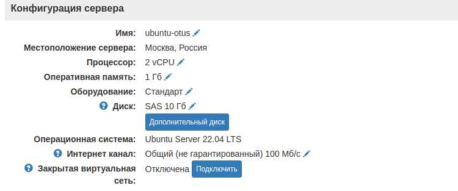
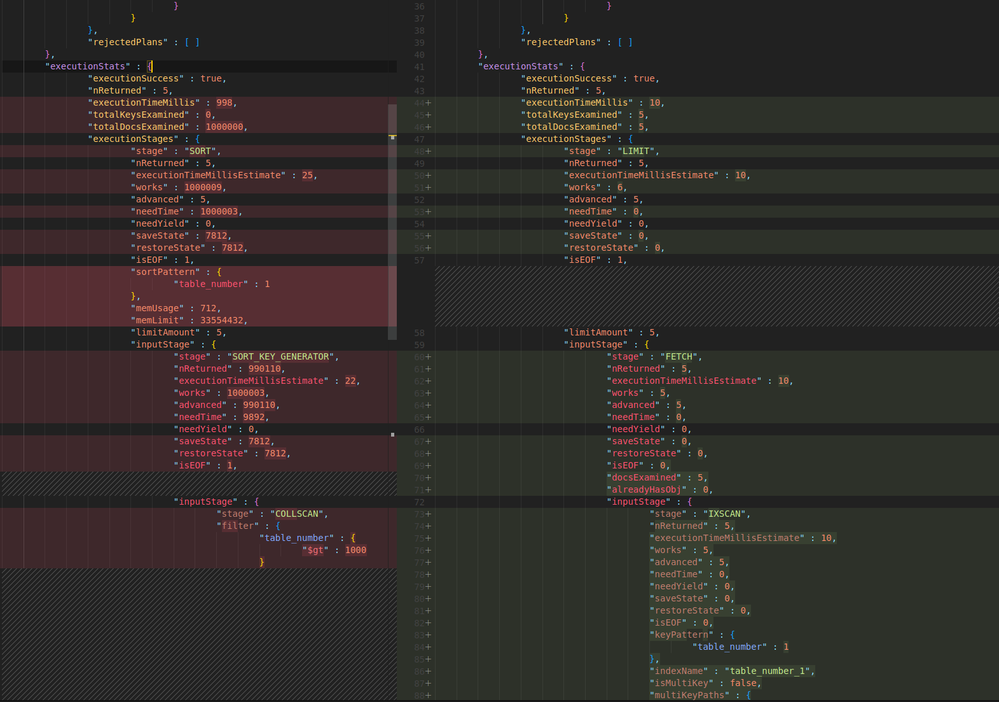

# Конфигурация сервера




# Запуск MongoDB

```yaml
version: "3"
services:
  mongo:
    image: mongo:4.2.21-bionic
    container_name: mongodb
    volumes:
      - ~/data/mongodb/db:/data/db
    ports:
      - "27017:27017"
```

```
docker-compose -f mongodbotus/docker-compose.yml 
```

# Подготовка набора данных *employees.json* для тестирования c помощью скрипта

Количество записей : 1 000 000 
```bash 
$ python3 generator_data.py
```
code: [Python скрипт для генерации данных](./geneartor_data.py)

Результат

```
root@vps-139128:~/mongodb# python3 generator_data.py 
Введите количество записей:1000000
Файл создан.

-rw-r--r-- 1 root root 125053139 Jul  4 16:15 employees.json
```

# Импорт данных

Заходим в контейнер и создаем БД в которую будем выполнять импорт данных.
```
docker exec -it mongodb bash
mongo
> use employees
> exit
exit
```
Копируем employees внутрь контейнера
```
docker cp employees.json mongodb:/
docker exec -it mongodb bash
mongoimport --db hw --collection employees --drop --jsonArray --file /employees.json
```
Результат
```
2022-07-04T13:31:31.283+0000	connected to: mongodb://localhost/
2022-07-04T13:31:31.284+0000	dropping: hw.employees
2022-07-04T13:31:34.283+0000	[#.......................] hw.employees	9.78MB/119MB (8.2%)
2022-07-04T13:31:37.283+0000	[#####...................] hw.employees	25.9MB/119MB (21.7%)
2022-07-04T13:31:40.283+0000	[########................] hw.employees	42.4MB/119MB (35.6%)
2022-07-04T13:31:43.283+0000	[###########.............] hw.employees	59.6MB/119MB (50.0%)
2022-07-04T13:31:46.283+0000	[###############.........] hw.employees	76.5MB/119MB (64.1%)
2022-07-04T13:31:49.283+0000	[##################......] hw.employees	93.5MB/119MB (78.4%)
2022-07-04T13:31:52.284+0000	[######################..] hw.employees	110MB/119MB (92.6%)
2022-07-04T13:31:54.056+0000	[########################] hw.employees	119MB/119MB (100.0%)
2022-07-04T13:31:54.057+0000	1000000 document(s) imported successfully. 0 document(s) failed to import.
```
Выполняем поиск 5 значений с `age` больше 90
```
mongo hw

> db.employees.find({ "age": {$gte: 90}}).limit(5)

{ "_id" : ObjectId("62c33e4502aed706499ae5c6"), "table_number" : 46653, "age" : 96, "name" : "Chris Wilson", "email" : "teresafuller@example.net", "phone" : "+1-759-913-9329" }
{ "_id" : ObjectId("62c33e4502aed706499ae5d0"), "table_number" : 10532, "age" : 94, "name" : "Randy Yoder", "email" : "kristinwright@example.net", "phone" : "321.159.4301" }
{ "_id" : ObjectId("62c33e4502aed706499ae5d9"), "table_number" : 32947, "age" : 93, "name" : "Heather Quinn", "email" : "rmyers@example.com", "phone" : "399-488-8857x8762" }
{ "_id" : ObjectId("62c33e4502aed706499ae5da"), "table_number" : 54239, "age" : 98, "name" : "Donald Klein", "email" : "phernandez@example.net", "phone" : "932-484-5192x44438" }
{ "_id" : ObjectId("62c33e4502aed706499ae5e4"), "table_number" : 92775, "age" : 98, "name" : "Matthew Roberts", "email" : "erika85@example.org", "phone" : "001-149-080-5170" }
```
Обновим *age* у сотрудника  с id `62c33e4502aed706499ae5c6`
```
> db.employees.updateOne({ _id: ObjectId("62c33e4502aed706499ae5c6") }, {$set: {"age": 30}})

{ "acknowledged" : true, "matchedCount" : 1, "modifiedCount" : 1 }
```
Найдем 5 значений с `table_number` больше 1000
```
db.employees.find({"table_number": {$gt: 1000}}).sort({"table_number": 1}).limit(5).explain("executionStats")
```
Результат
```json
{
        "queryPlanner" : {
                "plannerVersion" : 1,
                "namespace" : "hw.employees",
                "indexFilterSet" : false,
                "parsedQuery" : {
                        "table_number" : {
                                "$gt" : 1000
                        }
                },
                "winningPlan" : {
                        "stage" : "SORT",
                        "sortPattern" : {
                                "table_number" : 1
                        },
                        "limitAmount" : 5,
                        "inputStage" : {
                                "stage" : "SORT_KEY_GENERATOR",
                                "inputStage" : {
                                        "stage" : "COLLSCAN",
                                        "filter" : {
                                                "table_number" : {
                                                        "$gt" : 1000
                                                }
                                        },
                                        "direction" : "forward"
                                }
                        }
                },
                "rejectedPlans" : [ ]
        },
        "executionStats" : {
                "executionSuccess" : true,
                "nReturned" : 5,
                "executionTimeMillis" : 998,
                "totalKeysExamined" : 0,
                "totalDocsExamined" : 1000000,
                "executionStages" : {
                        "stage" : "SORT",
                        "nReturned" : 5,
                        "executionTimeMillisEstimate" : 25,
                        "works" : 1000009,
                        "advanced" : 5,
                        "needTime" : 1000003,
                        "needYield" : 0,
                        "saveState" : 7812,
                        "restoreState" : 7812,
                        "isEOF" : 1,
                        "sortPattern" : {
                                "table_number" : 1
                        },
                        "memUsage" : 712,
                        "memLimit" : 33554432,
                        "limitAmount" : 5,
                        "inputStage" : {
                                "stage" : "SORT_KEY_GENERATOR",
                                "nReturned" : 990110,
                                "executionTimeMillisEstimate" : 22,
                                "works" : 1000003,
                                "advanced" : 990110,
                                "needTime" : 9892,
                                "needYield" : 0,
                                "saveState" : 7812,
                                "restoreState" : 7812,
                                "isEOF" : 1,
                                "inputStage" : {
                                        "stage" : "COLLSCAN",
                                        "filter" : {
                                                "table_number" : {
                                                        "$gt" : 1000
                                                }
                                        },
                                        "nReturned" : 990110,
                                        "executionTimeMillisEstimate" : 17,
                                        "works" : 1000002,
                                        "advanced" : 990110,
                                        "needTime" : 9891,
                                        "needYield" : 0,
                                        "saveState" : 7812,
                                        "restoreState" : 7812,
                                        "isEOF" : 1,
                                        "direction" : "forward",
                                        "docsExamined" : 1000000
                                }
                        }
                }
        },
        "serverInfo" : {
                "host" : "90a523307c46",
                "port" : 27017,
                "version" : "4.2.21",
                "gitVersion" : "b0aeed9445ff41af07449fa757e1f231bce990b3"
        },
        "ok" : 1
}
```
 Создадим индекс для поля `table_number` и запустим запрос еще раз
 ```
> db.employees.createIndex({table_number: 1})

{
        "createdCollectionAutomatically" : false,
        "numIndexesBefore" : 1,
        "numIndexesAfter" : 2,
        "ok" : 1
}
```
Выполним повторно запрос 
```
db.employees.find({"table_number": {$gt: 1000}}).sort({"table_number": 1}).limit(5).explain("executionStats")
```
Результат 
```JSON
{
        "queryPlanner" : {
                "plannerVersion" : 1,
                "namespace" : "hw.employees",
                "indexFilterSet" : false,
                "parsedQuery" : {
                        "table_number" : {
                                "$gt" : 1000
                        }
                },
                "winningPlan" : {
                        "stage" : "LIMIT",
                        "limitAmount" : 5,
                        "inputStage" : {
                                "stage" : "FETCH",
                                "inputStage" : {
                                        "stage" : "IXSCAN",
                                        "keyPattern" : {
                                                "table_number" : 1
                                        },
                                        "indexName" : "table_number_1",
                                        "isMultiKey" : false,
                                        "multiKeyPaths" : {
                                                "table_number" : [ ]
                                        },
                                        "isUnique" : false,
                                        "isSparse" : false,
                                        "isPartial" : false,
                                        "indexVersion" : 2,
                                        "direction" : "forward",
                                        "indexBounds" : {
                                                "table_number" : [
                                                        "(1000.0, inf.0]"
                                                ]
                                        }
                                }
                        }
                },
                "rejectedPlans" : [ ]
        },
        "executionStats" : {
                "executionSuccess" : true,
                "nReturned" : 5,
                "executionTimeMillis" : 10,
                "totalKeysExamined" : 5,
                "totalDocsExamined" : 5,
                "executionStages" : {
                        "stage" : "LIMIT",
                        "nReturned" : 5,
                        "executionTimeMillisEstimate" : 10,
                        "works" : 6,
                        "advanced" : 5,
                        "needTime" : 0,
                        "needYield" : 0,
                        "saveState" : 0,
                        "restoreState" : 0,
                        "isEOF" : 1,
                        "limitAmount" : 5,
                        "inputStage" : {
                                "stage" : "FETCH",
                                "nReturned" : 5,
                                "executionTimeMillisEstimate" : 10,
                                "works" : 5,
                                "advanced" : 5,
                                "needTime" : 0,
                                "needYield" : 0,
                                "saveState" : 0,
                                "restoreState" : 0,
                                "isEOF" : 0,
                                "docsExamined" : 5,
                                "alreadyHasObj" : 0,
                                "inputStage" : {
                                        "stage" : "IXSCAN",
                                        "nReturned" : 5,
                                        "executionTimeMillisEstimate" : 10,
                                        "works" : 5,
                                        "advanced" : 5,
                                        "needTime" : 0,
                                        "needYield" : 0,
                                        "saveState" : 0,
                                        "restoreState" : 0,
                                        "isEOF" : 0,
                                        "keyPattern" : {
                                                "table_number" : 1
                                        },
                                        "indexName" : "table_number_1",
                                        "isMultiKey" : false,
                                        "multiKeyPaths" : {
                                                "table_number" : [ ]
                                        },
                                        "isUnique" : false,
                                        "isSparse" : false,
                                        "isPartial" : false,
                                        "indexVersion" : 2,
                                        "direction" : "forward",
                                        "indexBounds" : {
                                                "table_number" : [
                                                        "(1000.0, inf.0]"
                                                ]
                                        },
                                        "keysExamined" : 5,
                                        "seeks" : 1,
                                        "dupsTested" : 0,
                                        "dupsDropped" : 0
                                }
                        }
                }
        },
        "serverInfo" : {
                "host" : "90a523307c46",
                "port" : 27017,
                "version" : "4.2.21",
                "gitVersion" : "b0aeed9445ff41af07449fa757e1f231bce990b3"
        },
        "ok" : 1
}
```
## ВЫВОД
 В первом случае было просмотрено 1 000 000 документов, параметр [`totalDocsExamined=1000000`], тогда как после создание индекса только 5 [`totalDocsExamined=5`]. Можно сделать вывод о том, что добавление индекса положительно повлияло на стоимость запроса.


